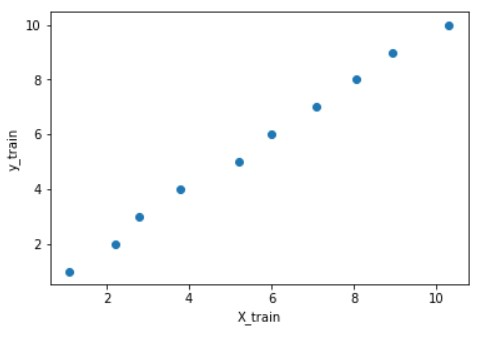
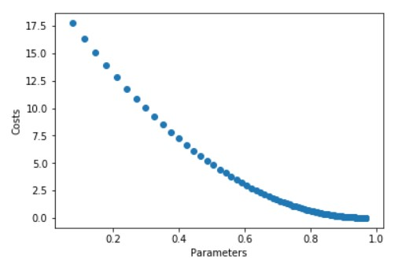
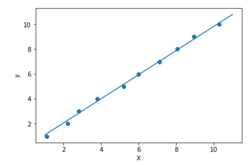

# Linear-Regression-from-Scratch
This is the most beginner level algorithm for diving into machine learning and I have tried to implement it in the easiest way possible without using any machine learning library.

It this notebook, you will understand the basics of **Linear Regression** and understand its process visually.  
1) Dataset                                               

2) Reduction of **Cost**

3) Curve Fitting

